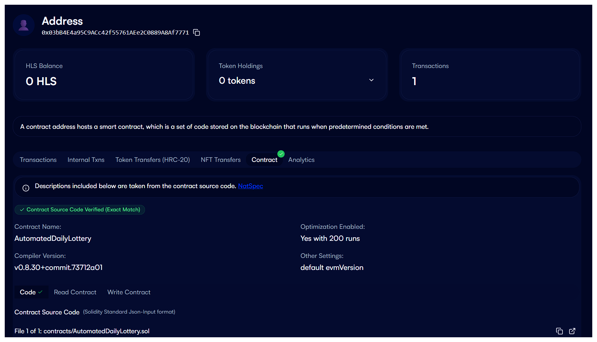

# Helios Automated Daily Lottery

This repository contains the code for a simple, automated daily lottery DApp built on the Helios blockchain. It serves as a tutorial for using **Chronos**, the native smart contract scheduling service on Helios.

## Quick Start

This section is for users who want to quickly deploy and run the project.

### Prerequisites

* [Node.js](https://nodejs.org/) (v18 or later)
* [MetaMask](https://metamask.io/) browser extension

### Setup

1. **Clone the repository:**

   ```bash
   git clone <repository-url>
   cd helios-lottery
   ```

2. **Install dependencies:**

   ```bash
   npm install
   ```

3. **Configure your environment:**
   * Create a `.env` file by copying the example: `cp .env.example .env`
   * Open the `.env` file and replace `YOUR_METAMASK_PRIVATE_KEY` with your actual private key (without the `0x` prefix).
   * Get some testnet HLS from the [Helios Testnet Faucet](https://testnet.helioschain.network) and send it to the wallet associated with your private key. You will need it for deployment and scheduling.

### Deployment, Verification, and Scheduling

Follow these steps in order to get your automated lottery up and running.

1. **Compile the contract:**

   ```bash
   npx hardhat compile
   ```

2. **Deploy the lottery contract:**

   ```bash
   npx hardhat run scripts/deploy.js --network helios_testnet
   ```

   The script will output the address of your deployed `AutomatedDailyLottery` contract. **Copy this address.**

3. **Verify the contract:**

   Run the helper script to generate the necessary verification files. The script will prompt you to enter the contract address you just copied.

   ```bash
   npx hardhat run scripts/extract-input.js
   ```

   This will create an `output` directory. Open the `output/verify-smart-contracts.md` file and follow the instructions inside to complete verification on the Helios Explorer.

   After verification, your smart contracts in helios explorer would be looks like this.

   

4. **Schedule the automated task:**

   Once your contract is verified, you can schedule the daily `drawWinner` function.
   * Open `scripts/schedule.js` and replace the placeholder `YOUR_DEPLOYED_CONTRACT_ADDRESS` with your actual contract address.
   * Run the scheduling script:

     ```bash
     npx hardhat run scripts/schedule.js --network helios_testnet
     ```

### Checking the Scheduled Task

Your automated lottery is now running! To verify that the Chronos task was scheduled correctly:

1. Go to the [Helios Explorer](https://explorer.helioschainlabs.org) and search for your deployed lottery contract address.
2. Go to the **"Read Contract"** tab.
3. Find the `getCronTaskInfo` function and click "Query".
4. You will see the `cronId`, the `cronWallet` address, and the `cronWalletBalance` (which should be 1 HLS). This confirms the task is scheduled and funded.

Successfully deploying and scheduling a task with Chronos earns you XP on the Helios Testnet!


---

## Tutorial: Building From Scratch

This tutorial will guide you through building, deploying, verifying, and scheduling the decentralized application from the very beginning.

### Introduction

Our goal is to build a lottery smart contract where users can purchase tickets. The winner selection process will be automatically triggered every 24 hours by the Chronos service, making the lottery truly autonomous and decentralized.

### Step 1: Setting Up the Project

First, we'll set up our development environment using Hardhat, a popular framework for Ethereum development.

1. **Create a project directory:**

   ```bash
   mkdir helios-lottery
   cd helios-lottery
   ```

2. **Initialize a Node.js project:**

   ```bash
   npm init -y
   ```

3. **Install Hardhat and dependencies:**

   ```bash
   npm install --save-dev hardhat @nomicfoundation/hardhat-toolbox dotenv chalk
   ```

4. **Initialize a Hardhat project:**

   ```bash
   npx hardhat
   ```

   Select "Create a JavaScript project" and accept the defaults.

5. **Create a `.gitignore` file:**

   Create a file named `.gitignore` in the root of your project and add the following lines to it:

   ```
   node_modules
   .env
   cache
   artifacts
   output
   ```

### Step 2: Configuring Hardhat for Helios

Now, we'll configure Hardhat to connect to the Helios Testnet.

1. **Create a `.env` file:**

   Create a file named `.env` in the root of your project. This file will store your private key. **Do not share this file with anyone.**

   ```
   PRIVATE_KEY=YOUR_METAMASK_PRIVATE_KEY
   ```

   Replace `YOUR_METAMASK_PRIVATE_KEY` with the private key of the account you want to use for deployment.

2. **Update `hardhat.config.js`:**

# 🎰 Helios Lottery dApp

This project is a decentralized lottery system deployed on the [Helios Testnet](https://github.com/helios-network), where a winner is automatically picked every 24 hours using [Chronos](https://docs.helios.org/chronos/intro), the Helios-native scheduling engine.

## ✨ Features

* ✅ Fully on-chain lottery
* ✅ Scheduled execution every 24 hours using Chronos
* ✅ Written in Solidity + Hardhat
* ✅ Deployed and scheduled successfully on Helios Testnet

---

## 🛠 Tech Stack

* Solidity (smart contracts)
* Hardhat (deployment & testing)
* Chronos (task scheduler on Helios)

---

## 📁 Project Structure

```
helios-lottery/
├── contracts/             # Smart contracts (Lottery.sol)
├── scripts/               # Deployment and scheduling scripts
├── test/                  # Unit tests
├── chronos.json           # Chronos task configuration
├── hardhat.config.js      # Hardhat setup
└── .env                   # Contains PRIVATE_KEY and RPC for Helios
```

---

## 🚀 Deployment Steps

### 1. Clone and install

```bash
git clone https://github.com/tieuhing/helios-lottery
cd helios-lottery
npm install
```

### 2. Configure `.env`

```env
PRIVATE_KEY=your_private_key
RPC_URL=https://rpc-testnet.helios.org
```

### 3. Deploy contract

```bash
npx hardhat run scripts/deploy.js --network helios_testnet
```

### 4. Schedule task with Chronos

```bash
npx hardhat run scripts/schedule.js --network helios_testnet
```

---

## 📸 Achievements

* ✅ Contract successfully deployed to Helios Testnet
* ✅ Task scheduled with Chronos
* ✅ GitHub repo ready for Helios Experience Pack submission


---

## 🧠 Author

* **tieuhing**
* Helios wallet: `YOUR_WALLET_ADDRESS`
* GitHub: [https://github.com/tieuhing](https://github.com/tieuhing)

---

## 🏱 Submission for Helios Experience Pack

This project is part of the **"Helios Experience Pack - Build with Chronos"** to earn **10,000 XP** from Helios Testnet.

